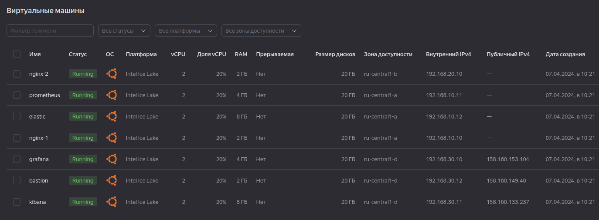
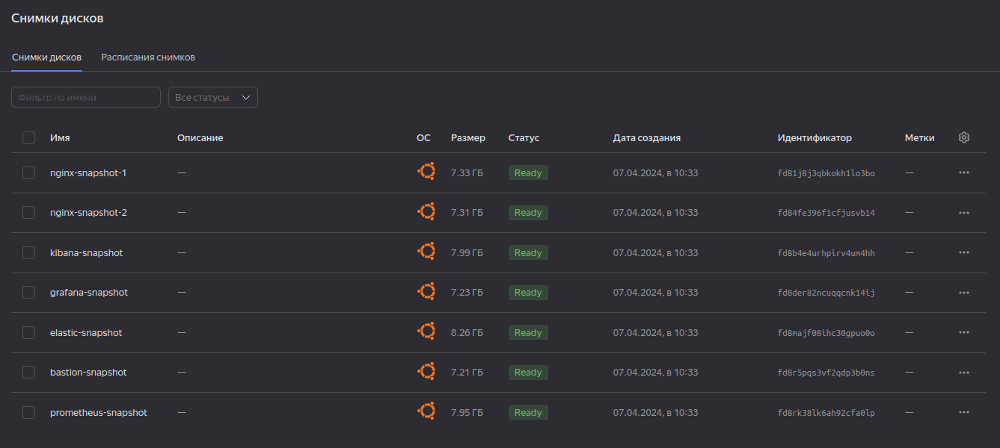
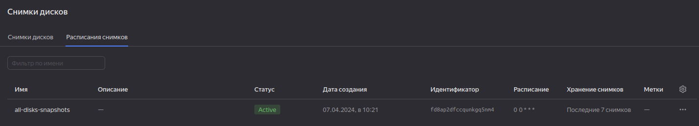
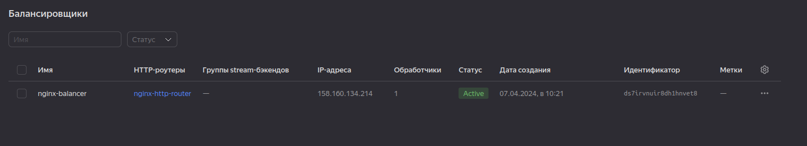
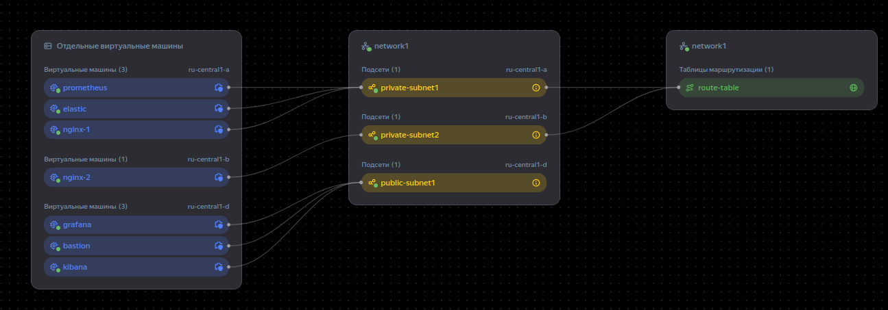
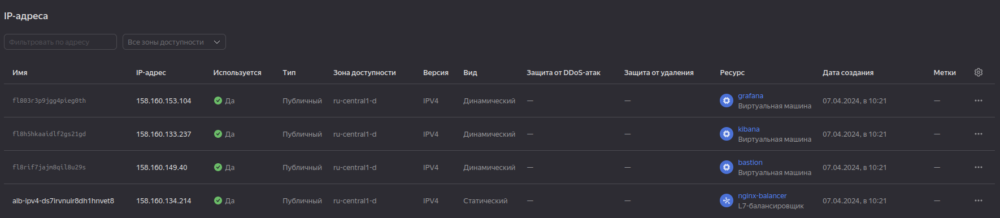

# termPaper — Пешева Ирина

Работа сделана в рамках [курсовой работы Netology](https://github.com/netology-code/fops-sysadm-diplom/blob/main/README.md).

## Краткое описание

Средствами Terraform в Яндекс.Облаке разворачивается структура, состоящая из двух web-серверов, Prometheus, Grafana, Elasticsearch, Kibana и Bastion host.<br/>
Web-сервера, Prometheus и Elasticsearch недоступны из внешней сети и обитают за NAT-шлюзом. Grafana, Kibana и Bastion host имеют публичные адреса.

### Web-сервера

Web-сервера используют Nginx, разнесены в разные зоны и аналогичны между собой. Доступ к ним производится через балансировщик.

Никакой богатой навигации, только Вайсо приветствует вас.

### Prometheus и Grafana

Prometheus получает данные от web-серверов. Сбором данных на web-серверах занимаются Node Exporter и Nginx Exporter.

Grafana получает данные от Prometheus. В Grafana настроен рабочий стол «Custom Dashboard». Для просмотра используется гостевая учётная запись guest (пароль guest).

*К сожалению, пока в дашборде Grafana ip адреса web-серверов вшиты намертво, что как бы сводит всю гибкость настройки через переменные на нет. (#38)*

### Elasticsearch и Kibana

В Elasticsearch отправляются данные с web-серверов с помощью установленного на них Filebeat. Логи собираются из `access.log` и `error.log` Nginx.

В Kibana отображаются логи. Есть уже готовый `data_view` Filebeat (маска `filebeat*`).

У Elasticsearch отключена всякая проверка подключения, что, конечно, а-та-та (кроме security groups, но это другое).

#### Откуда дровишки

Elasticsearch, Kibana и Filebeat берутся с зеркала yandex'а.

### Bastion host

Виртуальная машина, через которую осуществляется доступ к остальным серверам через SSH — этот порт в сети открыт только для bastion host. В остальном ничего не делает и ничего не хранит.

## Настройка и запуск

### Минимальные действия для запуска

1. В корне создать директорию `.ssh`. В ней сгенерировать [пару ключей](https://yandex.cloud/ru/docs/compute/operations/vm-connect/ssh) с названием `terraform`.
2.  В директории `terraform` создать файл `meta.yml`. В нём разместить файл вида<br/>
```yaml
users:
  - name: ansibler
    groups: sudo
    shell: /bin/bash
    sudo: ['ALL=(ALL) NOPASSWD:ALL']
    ssh-authorized-keys:
      - <открытая_часть_ключа>
```
Вместо `<открытая_часть_ключа>` указать содержимое сгенерированного файла `terraform.pub`.

3. В директории `terraform` создать файл `terraform.tfvars`. В нём указать содержимое вида:
```tfvars
#=====provider=====
oauth_token = "<oauth_token>"
cloud_id    = "<cloud_id>"
folder_id   = "<folder_id>"
```
Значения переменных найти в Yandex.Cloud: [oauth_token](https://yandex.cloud/ru/docs/iam/concepts/authorization/oauth-token), [cloud_id](https://yandex.cloud/ru/docs/resource-manager/operations/cloud/get-id), [folder_id](https://yandex.cloud/ru/docs/resource-manager/operations/folder/get-id).

4. В директории `ansible/roles/grafana/vars` создать файл `secret.yml` в нём разместить содержимое вида:<br/>
```yml
---
grafana_admin_password: "<some_password>"
```
Вместо `<some_password>` указать любой пароль — это пароль к учётной записи `admin` в Grafana.

5. Запустить Terraform:
```bash
sudo terraform init
sudo terraform apply
```

### Дополнительные настройки

Расширенная настройка:

| Файл | Для чего |
|---|---|
| [variables.tf](terraform/variables.tf) | Можно задать прерываемость машин, создание NAT-адресов для ВМ в частной сети, задать внутренние ip, изменить зоны расположения, выбрать id операционной системы, путь до `meta.yml`. |
| [Yandex mirror vars](ansible/roles/yandex-efk-mirror/vars/main.yml) | Мажорная версия Elasticsearch; отсюда версии Kibana и Filebeat |
| [index.html](ansible/roles/nginx/files/nginx.conf) | Содержимое отображаемой страницы при обращении к web-серверу |
| [nginx.conf](ansible/roles/nginx/files/nginx.conf) | Конфигурация Nginx |
| [prometheus-nginxlog-exporter.hcl](ansible/roles/nginx-exporter/files/prometheus-nginxlog-exporter.hcl) | Конфигурация Nginx Log Exporter |
| [Nginx Log Exporter vars](ansible/roles/nginx-exporter/vars/main.yml) | Версия Node Nginx Log Exporter |
| [node-exporter.service.j2](ansible/roles/node-exporter/templates/node-exporter.service.j2) | Файл сервиса для Node Exporter |
| [Node Exporter vars](ansible/roles/node-exporter/vars/main.yml) | Настройка версии Node Exporter'а и пользователя/группу, из-под которого он будет запускаться |
| [filebeat.yml.j2](ansible/roles/filebeat/templates/filebeat.yml.j2) | Файл конфигурации Filebeat |
| [prometheus.service.j2](ansible/roles/prometheus/templates/prometheus.service.j2) | Файл сервиса для Prometheus |
| [Prometheus vars](ansible/roles/prometheus/vars/main.yml) | Настройка версии Prometheus и пользователя, из-под которого он будет запускаться |
| [custom_dashboard.json](ansible/roles/grafana/files/custom_dashboard.json) | Отображаемый в Grafana рабочий стол |
| [Grafana vars](ansible/roles/grafana/vars/main.yml) | Версия Grafana и пароль для гостевой УЗ |
| [elasticsearch.yml](ansible/roles/elasticsearch/files/elasticsearch.yml) | Настройка конфигурации Elasticsearch |
| [kibana.yml](ansible/roles/kibana/templates/kibana.yml) | Файл конфигурации Kibana |
| [ansible.cfg](ansible/ansible.cfg) | Конфигурация Ansible |
 


## Структура файлов

### Terraform

Файл запуска Terraform разделён на несколько составляющих: main.tf, network.tf, virtual_machines.tf, security_groups.tf, ansible.tf, snapshots.tf. Рассмотрим их и variables.tf.

#### [main.tf](terraform/main.tf)

Настройка провайдера. Для корректной работы требуется заполнить файл `terraform.tfvars` (см. Минимальные действия для запуска).

Здесь же настроен output: по завершению развёртывания отобразятся публичные адреса балансировщика, Grafana, Kibana, bastion host.

#### [network.tf](terraform/network.tf)

Создание сети, подсетей, nat.

Сети и nat созданы стандартно. С подсетями интереснее:
* private-subnet-1. По умолчанию размещается в зоне `ru-central1-a`. Спрятана за NAT.
* private-subnet-2. По умолчанию размещается в зоне `ru-central1-b`. Спрятана за NAT. Создана исключительно для разделения web-серверов по разным зонам.
* public-subnet-1. По умолчанию размещается в зоне `ru-central1-d`. Здесь все имеют публичные адреса и в отдельном NAT не нуждаются.

#### [security_groups.tf](terraform/security_groups.tf)

| Группа безопасности | Где используется | Ограничения |
|---|---|---|
| bastion-sg | Bastion host | На порт 22 можно подключиться можно откуда угодно. Разрешён весь исходящий трафик.  |
| ssh-sg | Все ВМ сети, кроме bastion host. | На порт 22 можно подключиться только с bastion host. Разрешён весь исходящий трафик (что немного не коррелирует с названием группы, но было удобно разместить здесь). |
| web-sg | ВМ с Nginx | Позволяет кому угодно обращаться к портам 80 и (на возможное будущее) 443, разрешает healthcheck балансировщика; для ВМ c Prometheus открыты порты 4040 и 9100 (порты exporter'ов). |
| prometheus-sg | ВМ с Prometheus | Разрешает ВМ с Grafana подключаться к порту 9090 (Prometheus). |
| grafana-sg | ВМ с Grafana | Разрешает всем на свете подключаться к порту 3000 (Grafana). |
| elasticsearch-sg | ВМ с Elasticsearch. | Позволяет ВМ с web и Kibana подключаться к порту 9200 (Elasticsearch). |
| kibana-sh | ВМ с Kibana | Позволяет кому угодно подключаться к порту 5601 (Kibana). |


#### [virtual_machines.tf](terraform/virtual_machines.tf)

Тьма виртуалок (и их дисков, конечно) и один балансировщик.

Основные особенности:
* nginx-vm1, prometheus-vm, elastic-vm находятся в зоне `private-subnet-1`.<br/>
 nginx-vm2 находится в `private-subnet-2`. <br/>
 grafana-vm, kibana-vm, bastion-vm находятся в `public-subnet-1`
* дискового простанства всем выделено одинаково, по 20Gb. Это прям сильно на вырост, потому что больше 9Gb никто из них не занимает.
* CPU у всех тоже одинаково — 2.
* RAM разделена каждому по потребностям (из расчёта, что большой нагрузки на них не предвидится):<br/>
2Gb для nginx-vm1, nginx-vm2, bastion-vm;<br/>
4Gb для prometheus-vm, grafana-vm;<br/>
8Gb для elastic-vm, kibana-vm.<br/>
* замечание: по-хорошему, нужно указать зависимость nginx-balancer от null_resource.ansible, потому что до поднятия Nginx он всё равно завершить создание не может (#35).
* в target-group балансировщика находятся nginx-vm-1 и nginx-vm-2. Настройки стандартные.

#### [ansible.tf](terraform/ansible.tf)

Здесь производится запуск файлов ansible и формирование файлов для него.

* local_file.ansible_hosts<br/>
Сюда складывается nat адрес bastion-vm и внутренние адреса остальных машин. Причина: разлитие идёт через bastion-host (см. `bastioners:vars`).<br/>
Почему такой страшный `ansible_ssh_common_args`, ведь есть же опция `-J`, настройки в ansible.cfg? `-J` не позволяет задать файл ключа для обоих хостов, и упорно ищет его (да ещё и со стандартным именем) в директории `./ssh` исполнителя. Через ansible.cfg тоже не получилось, хотя надежда не потеряна (#31).<br/>
Сформированный файл `hosts` складывается в директорию `ansible`.
* local_file.tf_variables<br/>
Формирует список переменных, общих для Terraform и Ansible. Пока что это только внутренние ip-адреса.<br/>
Складывает файл `tf_variables.yml` в директорию `ansible/group_vars/all`
* null_resource.ansible<br/>
Запуск Ansible. Производится только после формирования local_file.ansible_hosts.<br/>
В идеале бы добавить ещё зависимость от local_file.tf_variables. А ещё лучше — зависимость от всех виртуальных машин. Terraform намного быстрее создаёт ВМ, чем работает Ansible + bastion-vm создаётся последней, но звучит не слишком надёжно (#36).

#### [snapshots.tf](terraform/snapshots.tf)

* yandex_compute_snapshot_schedule.default<br/>
Снапшоты создаются каждый день для всех дисков в полночь; максимальное количество хранимых спапшотов — 7, из чего выходит, что время их жизни составляет неделю.
* yandex_compute_snapshot.*<br/>
Ctrl + c, Ctrl + v. Снапшот каждого диска. Совершается после завершения работы ansible (т.е. null_resource.ansible), а иначе зачем на снапшот пустых дисков.


#### [variables.tf](terraform/variables.tf)

* zone_a, zone_b, zone_d. Задают `ru-central-a`, `ru-central-b`, `ru-central-d` соответственно. Нужны на случай внезапного переноса между зонами (как будто тогда лучше было назвать их zone_1, zone_2 и zone_3 (#37)).
* preemptible. Задаёт в виртуальных машинах, являются ли они прерываемыми. Нужна для отладки.
* nat_for_private. Задаёт наличие NAT для машин в приватной сети. Нужна для отладки на случай, если что-то не так с bastion-vm.
* metadata-path. Путь до meta.yml.
* ubuntu-id. ID образа для виртуальных машин. При необходимости может быть заменён на более или менее актуальный, но протестировано всё на Ubuntu 22.04.
* oauth_token, cloud_id, folder_id подгружаются из `terraform.tfvars`.
* *_ip. Внутренние адреса виртуальных машин. Изменяя, следите за принадлежностью к подсетям!

### Ansible

#### Роли

##### [initialisation](ansible/roles/initialisation/)

Действия при подключении к ВМ. Применяется ко всем ВМ.<br/>
Содержит только tasks:
* пытается подключиться (timeout — 120 секунд);
* удаляет файл `/var/lib/dpkg/lock`. Костыль, поставленный в рамках проблемы #32. Где-то раз в 3 запуска nginx-1 или nginx-2 (один раз даже bastion) падали из-за блокировки. Фу-фу-фу так делать и вмешиваться в работу, но на то и костыль.
* обновляет список пакетов.

##### [yandex-efk-mirror](ansible/roles/yandex-efk-mirror/)

Настройка подлкючения к зеркалу Yandex для получения Elasticsearch, Kibana и Filebeat.

vars:
* elastic_major_version. Мажорная весрия Elasticsearch; от неё пляшут Kibana и Filebeat.

tasks:
* подключается репозиторий yandex с нужным Elastic'ом;
* обновляется список пакетов.


##### [nginx](ansible/roles/nginx/)

Настройка nginx.

files:
* index.html. Просто файл, отображаемый при обращении к web-серверу.
* nginx.conf. Конфигурация Nginx. Пока просто задаёт путь к файлам.

tasks:
* устанавливается Nginx;
* копируются файлы nginx.conf (в `etc/nginx/nginx.conf`) и index.html (в `/var/www/default`);
* поднимается сервис и проверяется его работа на порту 80.

##### [nginx-exporter](ansible/roles/nginx-exporter/)

Настройка Nginx Log Exporter'а.

files:
* prometheus-nginxlog-exporter.hcl. Файл настроек.

vars:
* nginx_log_exporter_version. Версия Nginx Log Exporter. Тестировалось на "1.9.2".

tasks:
* добавляется доступ к `var/log/nginx/access.log`;
* стягивается и устанавливается пакет Nginx Log Exporter с github;
* копируется файл конфигурации в `/etc/prometheus-nginxlog-exporter.hcl`;
* запускается сервис и проверяется порт 4040.

##### [node-exporter](ansible/roles/node-exporter/)

Настройка Node Exporter.

templates:
* node-exporter.service.j2. Настройка запуска сервиса.

vars:
* node_exporter_version. Версия Node Exporter'а. Тестировалось на "1.7.0".
* node_exporter_user, node_exporter_group. Настройки для создания пользователя, из-под которого будет запущен сервис Node Exporter'а.

tasks:
* создаются пользователь и группа для УЗ, запускающей Node Exporter.
* стягивается и распаковывается архив Node Exporter'а.
* файлы располагаются в /etc/node-exporter/node_exporter;
* всё это добро пакуется в сервис и запускается;
* запускается сервис и проверяется порт 9100.

##### [filebeat](ansible/roles/filebeat/)

Настройка Filebeat.

templates:
* filebeat.yml. Конфигурация Filebeat. Подставляется внутренний ip elasticsearch.

tasks:
* устанавливается Filebeat;
* доставляется файл конфигурации;
* запускается сервис.

##### [prometheus](ansible/roles/prometheus/)

Настройка Prometheus.

templates:
* prometheus.service.j2. Файл настройки сервиса Prometheus.

vars:
* prometheus_version. Версия Prometheus; тестировалось на "2.50.1".
* prometheus_user и prometheus_group. Настройки пользователя, из-под которого будет запускаться Prometheus.

tasks:
* создаются пользователь/группа для запуска Prometheus;
* с gitHub стягивается архив Prometheus;
* архив распаковывается; файлы раскидываются по /etc/prometheus, /var/lib/prometheus, /usr/local/bin;
* задаются машины, с которых можно стягивать данные (тут желательно поменять на загрузку полноценного файла (#39));
* для сервиса закидывется файл и производится запуск; проверяется порт 9090.

##### [grafana](ansible/roles/grafana/)

Настройка Grafana

files:
* custom_dashboard.json. Выгруженный в формате JSON рабочий стол.

vars:
* grafana_version. Версия Grafana; тестировалось на "10.4.0";
* guest_password. Пароль для гостевой УЗ.

Также в vars, файл secret.yml:
* grafana_admin_password. Пароль для админской УЗ.

tasks:
* добавляются необходимые пакеты adduser, libfontconfig1, musl
* стаскивается пакет и устанавливается Grafana;
* в файле `/usr/share/grafana/conf/defaults.ini` меняется админский пароль;
* запускается сервис Grafana и проверяется порт 3000;
* в Grafana добавляются рабочий стол Custom dashboard и гостевой пользователь.

##### [elasticsearch](ansible/roles/elasticsearch/)

Настройка Elasticsearch

files:
* elasticsearch.yml. Конфигурация Elasticsearch. 

tasks:
* устанавливается Elasticsearch;
* копируется файл конфигурации;
* запускается сервис и проверяется адрес 9200.

##### [kibana](ansible/roles/kibana/)

templates:
* kibana.yml. Конфигурация Kibana. Тут только адрес elastic задаётся.

tasks:
* устанавливается Kibana;
* заменяется файл конфигурации;
* запускается сервис и проверяется порт 5601 (здесь задаётся 30 секундная задержка, иначе может упасть создание data_view по API);
* создаётся data_view `Filebeat`.

#### playbook

В плейбуке:
* bastion-vm только инициализируется;
* nginx-vm-1 и nginx-vm-2 инициализируются, запускаются роли nginx, node-exporter, nginx-exporter, yandex-efk-mirror, filebeat;
* prometheus-vm инициализируется, запускается роль prometheus;
* grafana-vm инициализируется, запускается роль grafana;
* elastic-vm инициализируется, запускается роль yandex-efk-mirror, elasticserach;
* kibana-vm инициализируется, запускается роль yandex-efk-mirror, kibana.

#### ansible.cfg

* чудовищным образом отключены коровы;
* отключен сбор фактов;
* inventory ищется в `./hosts`;
* ключи ищутся каталогом выше, в `../.ssh/terraform`;
* подключение к ansible через пользователя ansibler.


## Результаты (на 07.04.2024)

ВМ:



Снапшоты:



И их расписание:



Балансировщик:



Сеть:



Публичные ресурсы:

